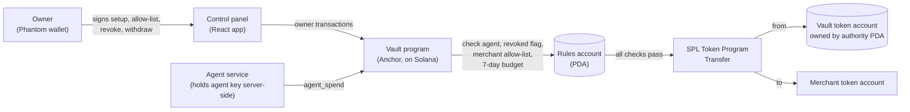

# Agent Vault

An on-chain vault program on Solana that lets AI agents pay merchants autonomously within owner-set limits, enforced by the program.

**Demo video:** [video link]

## What it does

An owner (a human with a Phantom wallet) funds a vault with an SPL token and registers agents that can spend from it. The program, not the application, decides whether each payment goes through:

- **Per-agent weekly budget.** Each agent has a budget over a resetting 7-day window. A spend that would exceed the remaining budget is refused; once 7 days have passed since the window started, the next spend opens a fresh window.
- **Merchant allow-list.** Each agent can only pay destination token accounts the owner has allow-listed, up to 4 merchants per agent. Deny-by-default: a newly added agent can't spend anywhere until the owner adds a merchant.
- **Revoke / unrevoke.** The owner can switch any agent off and back on instantly, without touching its budget or allow-list.
- **Owner withdraw.** The owner can pull funds back out of the vault at any time.
- **Limits:** max 2 agents per vault; one vault holds one token (one vault per owner + mint).

Refusals come back as named program errors (`BudgetExceeded`, `MerchantNotAllowed`, `AgentRevoked`, …) which the UI shows in plain English.

## Architecture



The vault token account is owned by a program-derived authority (PDA), so no human or agent key can move funds directly; the only way out is through the program's checks. The agent's private key never reaches the browser.

## Why a custom program

SPL token delegation (`Approve`) and allowance-style approaches cap how much a delegate can spend, but they can't say *where* it may spend it, and they have no per-agent on/off switch that leaves the rest of the setup intact. This program adds the missing pieces: a merchant allow-list per agent and a per-agent revoke toggle, alongside the budget window, all checked on-chain before any transfer.

## Repo layout

| Folder | What's in it |
|---|---|
| `agent_vault/` | The Anchor program (Rust), its LiteSVM tests, and `Anchor.toml` |
| `app/` | React + Vite front end: the owner control panel and a demo storefront |
| `agent-service/` | Node service that holds the agent keys server-side and signs payments; also the scripted demo scenario |
| `scripts/` | Devnet setup: aUSD token creation and metadata, keypair generation, preflight and state checks |

Other files: `DEMO-VAULT.md` (devnet addresses), `DEMO-SCRIPT.md` (recording script), `NOTES.md` / `EXPORT.md` (build log and export).

## Devnet addresses

Public keys only.

| Item | Address |
|---|---|
| Program | [`B4YLQmwWCt8fPu23hhpEeV4LZSkoKHsWQtWk15kc8Ajj`](https://solscan.io/account/B4YLQmwWCt8fPu23hhpEeV4LZSkoKHsWQtWk15kc8Ajj?cluster=devnet) |
| aUSD mint (Agent USD, 0 decimals) | [`EMiGUP2fckjgjgHiTnG4237q3jY4PygPg6zZeVb5fNh9`](https://solscan.io/token/EMiGUP2fckjgjgHiTnG4237q3jY4PygPg6zZeVb5fNh9?cluster=devnet) |
| Demo rules account | [`Gd3nKiCXJ4yMSNG1uUi67WR5F8CazRa9PDVqQnaSGosb`](https://solscan.io/account/Gd3nKiCXJ4yMSNG1uUi67WR5F8CazRa9PDVqQnaSGosb?cluster=devnet) |
| Vault token account | [`A7WEBomt7tZcn7obsEvncWaDqVZ8D2nqGfxjp5JdC3ZU`](https://solscan.io/account/A7WEBomt7tZcn7obsEvncWaDqVZ8D2nqGfxjp5JdC3ZU?cluster=devnet) |

The demo vault has two agents (`food-ordering-agent`, `shopping-agent`) with a 200 aUSD weekly budget each and four invented merchants apiece. See `DEMO-VAULT.md`.

## Tests

Ten tests in `agent_vault/programs/agent_vault/tests/test_vault.rs`, run in-process with [LiteSVM](https://github.com/LiteSVM/litesvm) (no validator needed):

| Test | Covers |
|---|---|
| `vault_initializes_with_correct_rules` | Vault creation sets owner, mint and accounts correctly |
| `successful_spend_moves_tokens_and_tracks_budget` | A valid spend transfers tokens and updates spent-so-far |
| `overspend_is_refused` | Spending past the weekly budget fails |
| `non_agent_signer_is_refused` | A signer that isn't a registered agent fails |
| `window_resets_after_seven_days` | Budget window resets after 7 days |
| `spend_to_non_allowlisted_merchant_is_refused` | Unlisted destination fails |
| `add_and_remove_merchant_gate_spending` | Allow-list changes take effect on spending |
| `add_merchant_rejects_duplicates_and_overflow` | No duplicate merchants; max 4 per agent |
| `revoked_agent_cannot_spend_until_unrevoked` | Revoke blocks spending; unrevoke restores it |
| `owner_can_withdraw_and_overdraw_is_refused` | Owner withdraw works; withdrawing more than the vault holds fails |

```bash
cd agent_vault
cargo test
```

## Known limitations

- **Devnet only.** Nothing here has been deployed to mainnet or audited.
- **Single upgrade authority.** The program is upgradeable by one key.
- **Plain `Transfer`, not `TransferChecked`.** The program's token transfers use SPL `Transfer`, so it is not yet compatible with the x402 "exact" scheme.
- **The agent is scripted, not an AI model.** The agent service executes payments from a scenario or from the storefront form; no model decides what to buy. The on-chain enforcement is the part that is real.
- **Public RPC rate limits.** The demo relies on public devnet RPC, which can throttle the control panel and agent service.

## Roadmap

1. **V1: on-chain vault** (this repo)
2. **V2:** off-chain policy engine
3. **V3:** x402 support
4. **V4:** multi-chain

## Built by

Built by Siva with Claude Code — I specified, directed and tested; Claude Code wrote the code.
