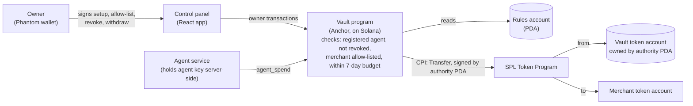
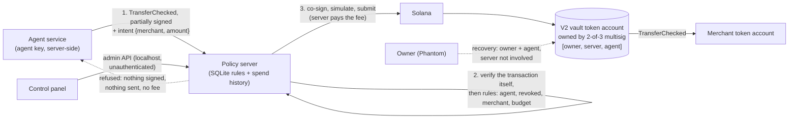

# Agent Vault

An on-chain vault program on Solana that lets AI agents pay merchants autonomously within owner-set limits, enforced by the program.

**Demo video:** coming soon

## What it does

An owner (a human with a Phantom wallet) funds a vault with an SPL token and registers agents that can spend from it. The program, not the application, decides whether each payment goes through:

- **Per-agent weekly budget.** Each agent has a budget over a resetting 7-day window. A spend that would exceed the remaining budget is refused; once 7 days have passed since the window started, the next spend opens a fresh window.
- **Merchant allow-list.** Each agent can only pay destination token accounts the owner has allow-listed, up to 4 merchants per agent. Deny-by-default: a newly added agent can't spend anywhere until the owner adds a merchant.
- **Revoke / unrevoke.** The owner can switch any agent off and back on instantly, without touching its budget or allow-list.
- **Owner withdraw.** The owner can pull funds back out of the vault at any time.
- **Limits:** max 2 agents per vault; one vault holds one token (one vault per owner + mint).

Refusals come back as named program errors (`BudgetExceeded`, `MerchantNotAllowed`, `AgentRevoked`, …) which the UI shows in plain English.

## Architecture



The vault token account is owned by a program-derived authority (PDA), so no human or agent key can move funds directly; the only way out is through the program's checks. The agent's private key never reaches the browser.

## Why a custom program

SPL token delegation (`Approve`) and allowance-style approaches cap how much a delegate can spend, but they can't say *where* it may spend it, and they have no per-agent on/off switch that leaves the rest of the setup intact. This program adds the missing pieces: a merchant allow-list per agent and a per-agent revoke toggle, alongside the budget window, all checked on-chain before any transfer.

## Repo layout

| Folder | What's in it |
|---|---|
| `agent_vault/` | The Anchor program (Rust), its LiteSVM tests, and `Anchor.toml` |
| `app/` | React + Vite front end: the owner control panel and a demo storefront |
| `agent-service/` | Node service that holds the agent keys server-side and signs payments; also the scripted demo scenario |
| `policy-server/` | V2: the off-chain policy server (SQLite rules, `/v2/authorize`, admin API), V2 setup script and tests |
| `scripts/` | Devnet setup: aUSD token creation and metadata, keypair generation, preflight and state checks |

Other files: `DEMO-VAULT.md` (devnet addresses), `DEMO-SCRIPT.md` (recording script), `NOTES.md` / `EXPORT.md` (build log and export).

## Devnet addresses

Public keys only.

| Item | Address |
|---|---|
| Program | [`B4YLQmwWCt8fPu23hhpEeV4LZSkoKHsWQtWk15kc8Ajj`](https://solscan.io/account/B4YLQmwWCt8fPu23hhpEeV4LZSkoKHsWQtWk15kc8Ajj?cluster=devnet) |
| aUSD mint (Agent USD, 0 decimals) | [`EMiGUP2fckjgjgHiTnG4237q3jY4PygPg6zZeVb5fNh9`](https://solscan.io/token/EMiGUP2fckjgjgHiTnG4237q3jY4PygPg6zZeVb5fNh9?cluster=devnet) |
| Demo rules account | [`Gd3nKiCXJ4yMSNG1uUi67WR5F8CazRa9PDVqQnaSGosb`](https://solscan.io/account/Gd3nKiCXJ4yMSNG1uUi67WR5F8CazRa9PDVqQnaSGosb?cluster=devnet) |
| Vault token account | [`A7WEBomt7tZcn7obsEvncWaDqVZ8D2nqGfxjp5JdC3ZU`](https://solscan.io/account/A7WEBomt7tZcn7obsEvncWaDqVZ8D2nqGfxjp5JdC3ZU?cluster=devnet) |

The demo vault has two agents (`food-ordering-agent`, `shopping-agent`) with a 200 aUSD weekly budget each and four invented merchants apiece. See `DEMO-VAULT.md`.

## Tests

Ten tests in `agent_vault/programs/agent_vault/tests/test_vault.rs`, run in-process with [LiteSVM](https://github.com/LiteSVM/litesvm) (no validator needed):

| Test | Covers |
|---|---|
| `vault_initializes_with_correct_rules` | Vault creation sets owner, mint and accounts correctly |
| `successful_spend_moves_tokens_and_tracks_budget` | A valid spend transfers tokens and updates spent-so-far |
| `overspend_is_refused` | Spending past the weekly budget fails |
| `non_agent_signer_is_refused` | A signer that isn't a registered agent fails |
| `window_resets_after_seven_days` | Budget window resets after 7 days |
| `spend_to_non_allowlisted_merchant_is_refused` | Unlisted destination fails |
| `add_and_remove_merchant_gate_spending` | Allow-list changes take effect on spending |
| `add_merchant_rejects_duplicates_and_overflow` | No duplicate merchants; max 4 per agent |
| `revoked_agent_cannot_spend_until_unrevoked` | Revoke blocks spending; unrevoke restores it |
| `owner_can_withdraw_and_overdraw_is_refused` | Owner withdraw works; withdrawing more than the vault holds fails |

```bash
cd agent_vault
cargo test
```

## V2 — off-chain policy engine

Same controls as V1 (weekly budget, merchant allow-list, revoke), enforced by an off-chain **policy server before anything is signed**. Funds sit in an SPL Token **2-of-3 multisig** vault, so the server alone can't move them, and neither can the agent alone.



**How a payment flows**

1. The agent builds one `TransferChecked` (vault → merchant token account, authority = the multisig, signers = agent + server, fee payer = server), signs its part, and POSTs it to `/v2/authorize` with its stated intent.
2. The server **decodes the transaction itself** and refuses unless it is exactly one Token Program `TransferChecked` from that agent's own V2 vault, with the right mint, decimals, multisig and signers, and with destination and amount equal to the intent (`TransactionMismatch`). It signs what it verified, never what it was told.
3. Then, in order: agent signature valid and agent registered (`AgentNotFound`), not revoked (`AgentRevoked`), merchant on this agent's enabled allow-list (`MerchantNotAllowed`), amount within the remaining 7-day budget (`BudgetExceeded`). A replayed transaction is refused as `DuplicateTransaction`.
4. On a pass, the spend is reserved as `pending` inside one SQLite transaction (so two concurrent requests can't both pass the budget check), then co-signed, simulated, submitted and confirmed. A failure releases the reservation.
5. On a refusal nothing is signed or submitted, so there is no transaction and no fee. The refusal is still logged for the audit trail.

**One multisig and one vault per agent.** With a single multisig shared by two agents, agent A + agent B would be a valid 2-of-3 and could move funds without the server. Each agent therefore has its own multisig `[owner, policy server, that agent]` and its own vault.

**Recovery path (owner + agent, server not involved).** If the server is down, the control panel's "Recover funds" builds one `TransferChecked` from a vault to the owner's own aUSD account. Phantom signs first; the agent service then re-verifies the exact bytes (one `TransferChecked`, that agent's own vault, destination = the owner's aUSD account, correct mint/decimals, owner as fee payer, owner's signature present) and adds the agent's signature. Agent keys never reach the browser.

### V1 vs V2

| | V1 on-chain program | V2 off-chain policy server |
|---|---|---|
| Who decides | Vault program on Solana | Policy server, before signing |
| Refused payment | Reaches chain, fails, fee paid | Never created, no fee |
| Trust | No trusted operator | Must trust the server (+ multisig limits blast radius) |
| Rule changes | On-chain transaction each | Instant, free, private |
| Rule types | Fixed by deployed code | Add rules without a redeploy |
| Chain-specific | Solana only | Pattern works on any chain |
| Uptime | Chain uptime | Server down = no agent payments (owner+agent recovery) |

V2 uses `TransferChecked` (V1 uses plain `Transfer`), which is what the x402 "exact" scheme requires. That removes V1's blocker for x402; it does not mean x402 is integrated.

### V2 devnet addresses

Public keys only (from `policy-server/v2.config.json`). Both agents use the same aUSD mint as V1.

| Item | Address |
|---|---|
| Policy server (fee payer, multisig signer) | [`7kemAvExKVKwtnqtJnJhuEmGs6MPodVY5mWu6FFAgNfZ`](https://solscan.io/account/7kemAvExKVKwtnqtJnJhuEmGs6MPodVY5mWu6FFAgNfZ?cluster=devnet) |
| food-ordering-agent-v2 | [`9TKrFoKECTzYxY94ipdSffMbnen1mdqSh27HhabsHM13`](https://solscan.io/account/9TKrFoKECTzYxY94ipdSffMbnen1mdqSh27HhabsHM13?cluster=devnet) |
| food multisig / vault | [`HmzkKgLRwRUHNGcPbJvAofRU5ymUT4L5WNJK5h2Rcqcx`](https://solscan.io/account/HmzkKgLRwRUHNGcPbJvAofRU5ymUT4L5WNJK5h2Rcqcx?cluster=devnet) / [`2mJtH5JRAdRvcHoTP7BA6iaViC8MYn4P6nJnWTmYREFx`](https://solscan.io/account/2mJtH5JRAdRvcHoTP7BA6iaViC8MYn4P6nJnWTmYREFx?cluster=devnet) |
| shopping-agent-v2 | [`oLBoaKP5vm1zHoyBYmpnETN5hsszGBeBaik3wze9SKm`](https://solscan.io/account/oLBoaKP5vm1zHoyBYmpnETN5hsszGBeBaik3wze9SKm?cluster=devnet) |
| shopping multisig / vault | [`DUPmqSMB1V2wBMZfSr93fPYgubpNaaa6e6wAxbX5cUhV`](https://solscan.io/account/DUPmqSMB1V2wBMZfSr93fPYgubpNaaa6e6wAxbX5cUhV?cluster=devnet) / [`5hpYPyKVsf9PeK1xz2Jd1RivuiBTVxPFVNkjw6BarjYp`](https://solscan.io/account/5hpYPyKVsf9PeK1xz2Jd1RivuiBTVxPFVNkjw6BarjYp?cluster=devnet) |
| Example live V2 payment (10 aUSD to Noonly) | [`2Mentzve…mkofc`](https://solscan.io/tx/2MentzveFzUnZAMwHRE7F4hvqg6zG69zRxwLHQ32FEcC2Bvr8vvJ7wcaD56HKDFakXdRe7DtqPUoZWjoHKCmkofc?cluster=devnet) |

### Running V2

```bash
cd policy-server && npm install && npm run setup   # one-time, idempotent: keys, multisigs, vaults, 300 aUSD each
npm start                                          # policy server on 127.0.0.1:4031
cd ../agent-service && npm start                   # agent service on 127.0.0.1:4021 (npm run scenario:v2 for the scripted V2 demo)
cd ../app && npm run dev                           # storefront and control panel both have a V1 | V2 switch (panel defaults to V2)
```

Tests are local (mock RPC, in-memory database, no devnet): `cd policy-server && npm test` (24) and `cd agent-service && npm test` (10). They cover pass, `BudgetExceeded`, `MerchantNotAllowed`, `AgentRevoked`, `TransactionMismatch` (different merchant, different amount, extra instruction, and more), concurrent requests that exceed the budget (exactly one passes), editable weekly limits (raise, lower below spent, invalid values, audit rows, racing an authorize), cross-agent isolation, and recovery to the owner (passes) versus anywhere else (refused). The tests need the key files under `keys/`.

### V2 control panel and admin API

The control panel has a V1 | V2 switch (default V2 on every load). V2 uses the same cards and styling as V1, driven by the policy server's `GET /v2/state`; V2 cards carry a small "V2 · off-chain policy" tag.

Admin API (localhost only, unauthenticated):

| Endpoint | Effect |
|---|---|
| `GET /v2/state` | Agents, merchants, recent spends, last 20 `ruleChanges` |
| `POST /v2/agents/:pubkey/revoke` / `unrevoke` | Block / unblock an agent |
| `POST /v2/merchants/:id/enable` / `disable` | Toggle a merchant for its agent |
| `POST /v2/agents/:pubkey/budget` | Set the weekly limit, body `{"weeklyBudget": 500}` |

```bash
curl -s -X POST http://127.0.0.1:4031/v2/agents/<AGENT_PUBKEY>/budget -H 'Content-Type: application/json' -d '{"weeklyBudget":500}'
```

**Weekly limit semantics.** The value must be a whole number from 1 to 10000 (aUSD has 0 decimals), otherwise `400 InvalidBudget`; an unknown agent gives `404 AgentNotFound`.

- It takes effect immediately for the current window: remaining = new budget − spent.
- Lowering it below what is already spent gives remaining 0. There is no clawback and no window reset.
- Pending reservations count as spent, exactly as `authorize` already treats them.
- The limit is a cap, not money: the vault balance still caps real spending.
- Every change writes one `rule_changes` row (agent, field, old value, new value, time) in the same SQLite transaction as the update, so it cannot race `authorize`.

**Deposit vs Withdraw in the V2 panel.**

- **Deposit** is one `TransferChecked` from your wallet's aUSD account to a V2 vault. You sign alone (authority and fee payer = owner). No multisig, no policy server, no agent.
- **Withdraw to my wallet** uses the recovery flow: it needs 2 of 3 signatures, you plus the agent (the agent service co-signs), and the destination is always your own aUSD account. The policy server is not involved, so it works while the server is down.

Out of scope in V2: creating a vault and adding a new agent (V2 has two fixed agents set up by `npm run setup`).

### V2 known limitations

- **Admin API is unauthenticated.** Revoke, unrevoke, merchant toggles and weekly-limit changes on the policy server have no authentication. It is safe only because it binds to `127.0.0.1`, but anyone on this machine could raise a limit. Next step: the owner signs admin changes with Phantom `signMessage`.
- **Recovery's "only back to the owner" rule is enforced off-chain.** The agent service refuses to co-sign anything else, but the multisig itself would let owner + agent send funds anywhere. The recovery checks are covered by tests; the Phantom flows for Deposit and Withdraw have been click-tested on devnet by the owner.
- **Trust in the server.** It decides what gets signed. The multisig limits the damage (the server alone can't move funds), but a compromised server can still approve payments that satisfy the rules and refuse everything else.
- **Server key is a plain key file.** Production would use an HSM or MPC custody (e.g. Fireblocks).
- **Two scripted agents.** Same as V1, the agents are scripted, not AI models.
- **Devnet only.**

## Known limitations (V1)

- **Devnet only.** Nothing here has been deployed to mainnet or audited.
- **Single upgrade authority.** The program is upgradeable by one key. Whoever holds that key could deploy new program logic, so it is the real trust point. A production deployment would put it behind a multisig plus timelock, or make the program immutable.
- **Plain `Transfer`, not `TransferChecked`.** The program's token transfers use SPL `Transfer`, so it is not yet compatible with the x402 "exact" scheme.
- **The agent is scripted, not an AI model.** The agent service executes payments from a scenario or from the storefront form; no model decides what to buy. The on-chain enforcement is the part that is real.
- **Public RPC rate limits.** The demo relies on public devnet RPC, which can throttle the control panel and agent service.

## Roadmap

1. **V1: on-chain vault** (this repo)
2. **V2:** off-chain policy engine (this repo, branch `v2`)
3. **V3:** x402 support
4. **V4:** multi-chain

## Built by

Built by Siva with Claude Code — I specified, directed and tested; Claude Code wrote the code.
